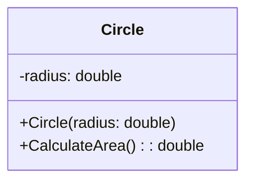
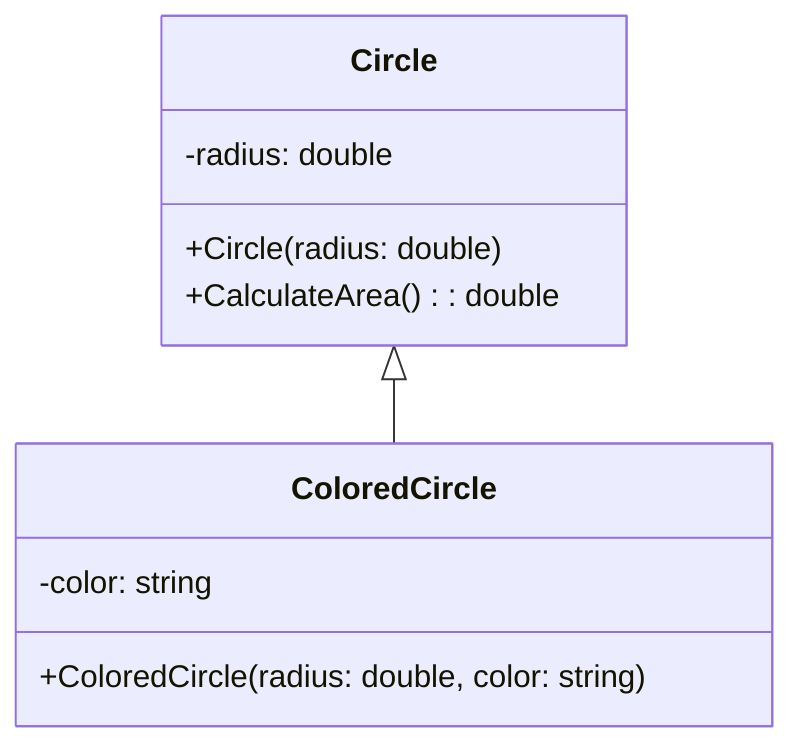

# C++ Exercise: Circle Class

## Objective

Create a C++ class named `Circle` that represents a circle. Implement a constructor to initialize the circle's radius and a method to calculate its area.

## Class Definition

Create a C++ class named `Circle` with the following properties and methods:

### Properties

- `radius` (double): The radius of the circle.

### Methods

1. **Constructor**: Create a constructor to initialize the `radius` property. This constructor should accept a single parameter, the radius of the circle, and set it.

2. **`double CalculateArea() const`**: Implement a method to calculate and return the area of the circle using the formula: `area = π * radius * radius`.



## Call

```cpp
int main() {
    // Create a Circle object with a radius
    Circle circle(5.0);

    // Calculate and print the area of the circle
    double area = circle.CalculateArea();
    std::cout << "Area of the circle: " << area << std::endl;

    return 0;
}
```

## Optional:

1. **Extend the Circle class**: Add a new property called `color` (a string) to represent the color of the circle.

2. **Create a constructor for the ColoredCircle class**: Implement a constructor for the `ColoredCircle` class that accepts both the radius and the color as parameters. Initialize both properties in the constructor.

3. **In the main function**: Create a `ColoredCircle` object with a radius and a color of your choice.

4. **Calculate and print the area**: Use the `CalculateArea` method to calculate and print the area of the `ColoredCircle`.


